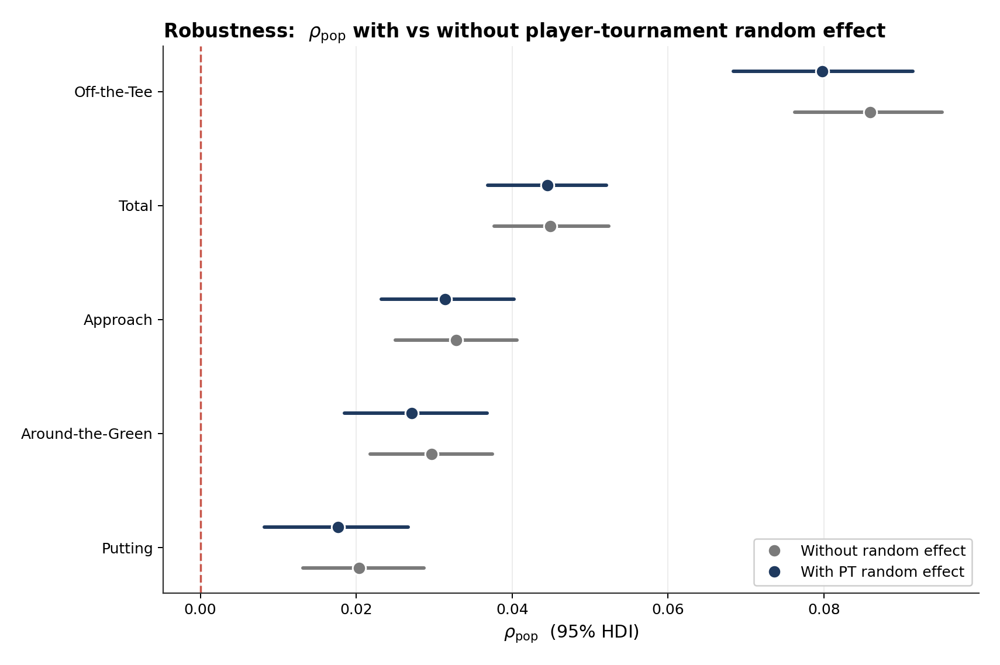
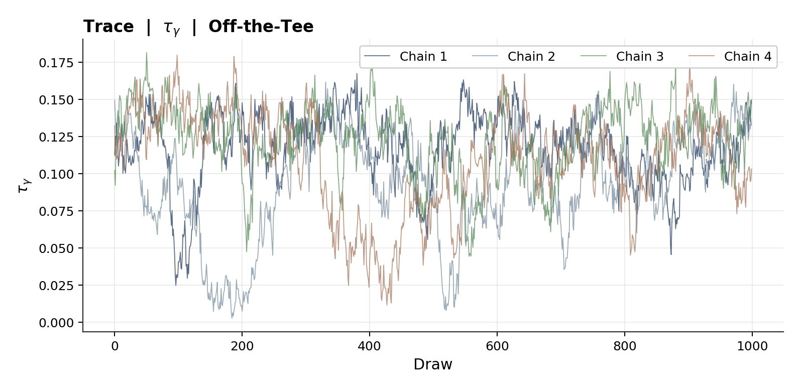
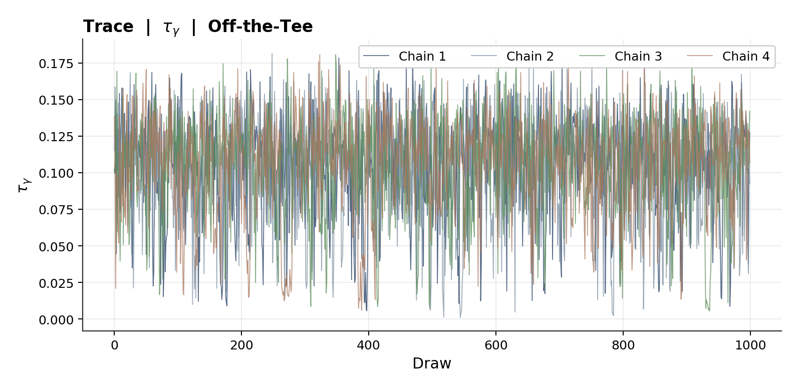
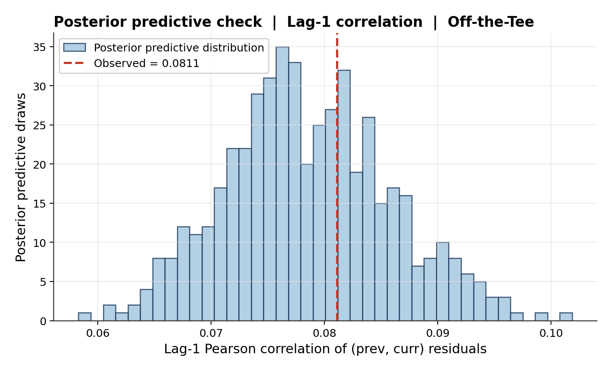

# Is Golf a Momentum Sport?

Testing i.i.d. against a hierarchical AR(1) for round-to-round residuals within a
single tournament.

**Jake Kostoryz · Isaiah Nick** — ST540 Applied Bayesian Analysis, NC State University

---

## Headline result

Within-tournament momentum is real, small, and **decays toward the hole**. Population
persistence runs from 0.080 off-the-tee down to 0.018 in putting. The component most
invoked in broadcast commentary is the one with the weakest evidence.



PSIS-LOO prefers AR(1) over independence on four of five components, and the signal
survives a player-tournament random effect that absorbs course fit and week conditions.

## Motivation

Golf is talked about as a momentum sport. Scheffler on riding it, Spieth on carrying
it, Rahm on trending. Form has been rigorously studied *across* tournaments and across
seasons. To build a live, in-tournament Bayesian updating model for win probability, we
need the same answer at the round-to-round level *within* a single tournament.

DataGolf's published work asks which skills predict the next round, pooled across a
player's whole history: a skill profile, not a within-tournament dynamic. This project
asks a narrower question. Take the residual ε from round r at tournament T. How much of
it shows up in round r+1 of the same tournament, once player skill and round conditions
are stripped out?

## Measurement

Round-level strokes gained by component (OTT, APP, ARG, PUTT) for PGA Tour and LIV
events, 2019-2026. Roughly 134K rounds across 674 players, sourced from DataGolf.

Raw SG cannot be used directly: the baseline is field-relative per round, so +1 SG
against a major field is not +1 SG against a weak field. AR(1) on raw SG would conflate
round-to-round dynamics with cross-tournament field-strength differences.

So per component we fit a Bayesian linear regression with N(0,1) priors on player skill
α and round difficulty δ, take the MAP estimate via ridge walk-forward each Monday on
the prior 5 years, and model the residual:

$$\varepsilon_{p,T,r} = SG_{p,T,r} - \hat{\alpha}_p - \hat{\delta}_{T,r}$$

- **α** — player skill, the pre-round expectation as of the Monday before the event
- **δ** — round difficulty. Field strength, course, weather, pin, tee draw, absorbed into one indicator
- **ε** — SG with skill and difficulty removed. This is the AR(1) input

The snapshot is always the one strictly before event date, so no leakage from the
tournament into its own skill prior.

### Worked example: Scheffler, 2025 Open Championship

| Round | sg_total | α | δ | ε |
|---|---|---|---|---|
| R1 | +5.04 | +3.16 | −0.42 | +2.29 |
| R2 | +7.41 | +3.16 | −0.23 | +4.47 |
| R3 | +2.97 | +3.16 | −0.75 | +0.56 |
| R4 | +1.89 | +3.16 | −0.79 | −0.49 |

Four rounds yield three consecutive pairs (R1→R2, R2→R3, R3→R4). Missed cuts contribute
one. Across PGA and LIV 2019-2026 the total-SG likelihood sees 90,990 pairs across 706
players; component-level likelihoods see roughly 70,000 pairs across 33,091
player-tournament clusters.

## Models

**Model A — independence (the null).** Each round residual is an independent draw.

$$y_{p,T,r} \sim N(0, \sigma^2), \qquad \sigma \sim \text{Half-}N(2)$$

**Model B — hierarchical AR(1).** Round r is a partial echo of round r−1.

$$y_{p,T,r} \mid y_{p,T,r-1} \sim N(\rho_p \, y_{p,T,r-1}, \sigma^2)$$

$$\rho_p \sim N(\rho_{pop}, \tau_\rho^2), \quad \rho_{pop} \sim N(0, 0.5^2), \quad \tau_\rho \sim \text{Half-}N(0.3)$$

$\rho_{pop}$ is the research target: tour-wide average persistence. $\tau_\rho$ is the
between-player SD, giving partial pooling. The prior on $\rho_{pop}$ is centered on the
null, and $\rho_{pop} < 0$ would indicate anti-momentum.

**Decision rule.** PSIS-LOO. If Model B beats Model A by more than 2 SE on out-of-sample
log density, the AR(1) signal is real.

## First pass

AR(1) wins on every component.

| Component | ρ mean | 95% CI | ΔLOO | Δ/SE |
|---|---|---|---|---|
| Off-the-Tee | 0.086 | [0.077, 0.095] | 249 | 9.1 |
| Total | 0.045 | [0.038, 0.052] | 88 | 6.2 |
| Approach | 0.033 | [0.026, 0.041] | 35 | 4.0 |
| Around-the-Green | 0.030 | [0.022, 0.037] | 27 | 3.3 |
| Putting | 0.020 | [0.014, 0.029] | 13 | 2.4 |

The estimate is suspect. Any constant offset across a player's four rounds at one
tournament (course fit, week conditions, a stale skill snapshot) mechanically inflates
$\rho_{pop}$. AR(1) reads a shared shift as momentum.

## The problem: 33K latents break convergence

The fix is a random effect $\gamma_{p,T}$, one number per player-tournament, absorbing
the shared shift. Sampling 33,000+ of them directly does not work.



Two chains collapse near zero. R-hat = 1.08, ESS = 37. Tightening the $\tau_\gamma$
prior from Half-N(0.5) to Half-N(0.2) traded poor mixing for 17% divergent transitions.
The funnel is geometric, not a tuning problem.

## The fix: marginalize γ

The sum of two Gaussians is Gaussian, so γ folds analytically into the likelihood's
covariance. Within each (player, tournament) cluster:

$$y_c \sim \text{MVN}\left(\mu_c(\rho_p), \; \sigma^2 I_k + \tau_\gamma^2 J_k\right)$$

where $J_k$ is the k×k matrix of ones. Identical posteriors on
$(\rho_{pop}, \tau_\rho, \tau_\gamma, \sigma)$, zero divergences, R-hat below 1.01,
roughly a 3 minute runtime.



Four chains mix around the same mean. What we lose: per-player-tournament γ values. The
control on ρ is identical, we just don't print them.

## Results with the random effect

$\rho_{pop}$ barely moves. The signal survives.

| Component | ρ mean | vs. first pass | 95% CI | ΔLOO | Δ/SE |
|---|---|---|---|---|---|
| Off-the-Tee | 0.080 | −7% | [0.069, 0.091] | 124 | 5.5 |
| Total | 0.045 | 0% | [0.037, 0.052] | 76 | 6.3 |
| Approach | 0.031 | −6% | [0.023, 0.040] | 20 | 3.0 |
| Around-the-Green | 0.027 | −10% | [0.019, 0.036] | 12 | 2.0 |
| Putting | 0.018 | −10% | [0.009, 0.027] | 5 | 1.2 |

Reduction is at most 10%. CIs widen slightly, the honest cost of the control. Component
ranking is preserved. The AR(1) signal is not an artifact of a course-fit offset.

## Validation

**Posterior predictive check.** Observed lag-1 correlation 0.081, simulated
0.079 ± 0.007 (p = 0.72). The AR(1) structure reproduces the headline statistic.



**Prior sensitivity.** $\rho_{pop}$ unchanged (Δ < 0.001) under $\rho_{pop}$ priors from
N(0, 0.2²) to N(0, 1.0²) and $\tau_\gamma$ priors from Half-N(0.2) to Half-N(0.5). Data
dominates.

## Findings

**AR(1) is the right framework.** PSIS-LOO prefers Model B on four of five components
(Δ/SE > 2). The iid null is rejected.

**Persistence decays toward the hole.** OTT (0.080) > APP (0.031) > ARG (0.027) > PUTT
(0.018). Monotone: the further from the hole, the more round-to-round signal carries.
The ordinal ranking reproduces DataGolf's historical-to-next-round result from a
completely different horizon.

**Robust to the control.** The marginalized random effect decreases $\rho_{pop}$ by no
more than 10%. Course fit, week conditions, and snapshot error don't explain it away.

**Verdict.** A Markov structure is justified for the live Bayesian win-probability model.

## Limitations

- **Pre-computed inputs.** α and δ are ridge point estimates. Uncertainty in those inputs does not propagate into the posterior on $\rho_{pop}$.
- **Gaussian likelihood underestimates tails.** The posterior predictive check shows roughly 3× more |ε| > 3 events than the model predicts. A Student-t likelihood would absorb extreme rounds. The $\rho_{pop}$ estimate is unaffected.
- **Mechanism agnostic.** Positive $\rho_{pop}$ is consistent with true momentum, with form evolving within the week, and with systematic intra-round condition variation. The model identifies autocorrelation; it does not distinguish among mechanisms.

## Repo contents

| File | Role |
|---|---|
| `adjusted_sg.py` | Walk-forward two-way fixed-effects ridge. Produces player skill snapshots (α) and round fixed effects (δ). |
| `build_residuals.py` | Builds the `momentum_residuals` table from rounds, skills and fixed effects. |
| `momentum_pymc.py` | Model A vs Model B per component, no random effect. First-pass results. |
| `momentum_pymc_explicit_gamma.py` | Explicit γ sampling. Retained to document the funnel. |
| `momentum_pymc_re.py` | Model A vs Model B with the marginalized player-tournament random effect. Headline results. |
| `ppc.py` | Posterior predictive check on lag-1 correlation. |
| `prior_sensitivity.py` | Sensitivity of $\rho_{pop}$ to prior specification. |
| `plot_diagnostics.py` | Trace, posterior, forest and shrinkage plots. |
| `results.txt` | Raw sampler output. |

```bash
python3 adjusted_sg.py
python3 build_residuals.py
python3 momentum_pymc.py
python3 momentum_pymc_re.py
python3 ppc.py
python3 prior_sensitivity.py
python3 plot_diagnostics.py
```

The source SQLite database is not included (API-licensed DataGolf data).

## Presentation

Full slide deck: [`report/momentum_presentation.pdf`](report/momentum_presentation.pdf)

## References

1. DataGolf (2020). Predictive power of strokes-gained categories: a year-over-year persistence analysis.
2. DataGolf. Historical raw data and predictions API.
3. Reich, B. J. & Ghosh, S. K. (2019). *Bayesian Statistical Methods with Applications to Machine Learning*. Chapman & Hall/CRC.
4. Gelman, A. (2006). Prior distributions for variance parameters in hierarchical models. *Bayesian Analysis*, 1(3), 515-533.
5. Betancourt, M. & Girolami, M. (2015). Hamiltonian Monte Carlo for hierarchical models. *Current Trends in Bayesian Methodology with Applications*, 79-101.
6. Vehtari, A., Gelman, A. & Gabry, J. (2017). Practical Bayesian model evaluation using leave-one-out cross-validation and WAIC. *Statistics and Computing*, 27(5), 1413-1432.
